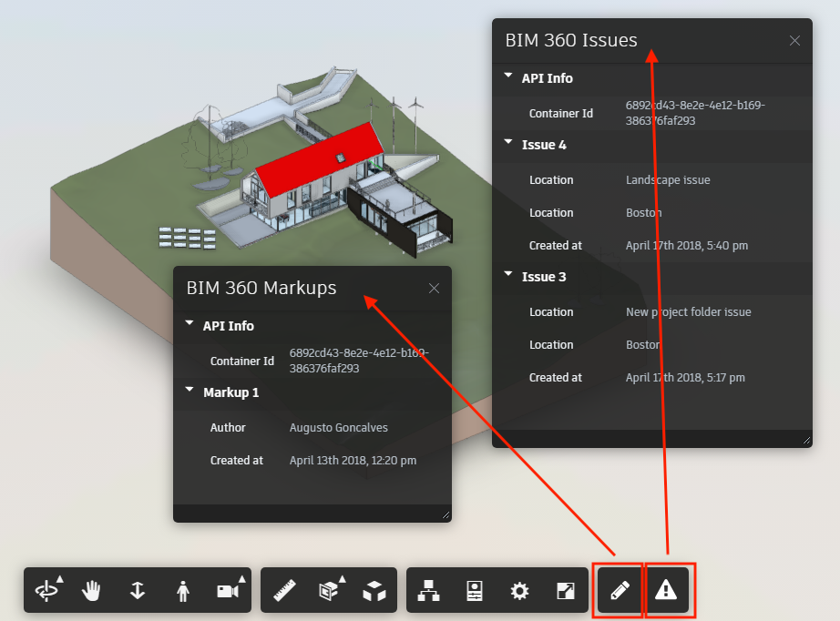

# data.management-csharp-bim360

# Description


[](http://opensource.org/licenses/MIT)

[](http://developer.autodesk.com/)
[](http://developer.autodesk.com/)
[](http://developer.autodesk.com/)
[](http://developer.autodesk.com/)

Demonstrate the **Markup** and **Document Issues** API for BIM 360 using Viewer Extensions, as shown on the image below.



This sample is based on the [Learn Forge](http://learnforge.autodesk.io) tutorials.

# Setup

For using this sample, you need an Autodesk developer credentials. Visit the [Forge Developer Portal](https://developer.autodesk.com), sign up for an account, then [create an app](https://developer.autodesk.com/myapps/create). For this new app, use **http://localhost:3000/api/forge/callback/oauth** as Callback URL, although is not used on 2-legged flow. Finally take note of the **Client ID** and **Client Secret**.

Provision your Client ID with your BIM 360 Account, [learn more](https://forge.autodesk.com/blog/bim-360-docs-provisioning-forge-apps)

### Run locally

Clone this project or download it. It's recommended to install [GitHub desktop](https://desktop.github.com/). To clone it via command line, use the following (**Terminal** on MacOSX/Linux, **Git Shell** on Windows):

    git clone https://github.com/autodesk-forge/forge.learning.viewhubmodels

Open the **web.config** file and adjust the Forge Client ID & Secret. If you plan to deploy to Appharbor, configure the variables on the host settings (no need to change this web.config file).

```xml
<appSettings>
  <add key="FORGE_CLIENT_ID" value="" />
  <add key="FORGE_CLIENT_SECRET" value="" />
  <add key="FORGE_CALLBACK_URL" value="http://localhost:3000/api/forge/callback/oauth" />
</appSettings>
```

No need to adjust the **FORGE\_CALLBACK\_URL** appSettings to run it locally.

Compile the solution, Visual Studio should download the NUGET packages ([Autodesk Forge](https://www.nuget.org/packages/Autodesk.Forge/), [RestSharp](https://www.nuget.org/packages/RestSharp) and [Newtonsoft.Json](https://www.nuget.org/packages/newtonsoft.json/)). 

## Tips & Tricks

This sample uses .NET Core and works fine on both Windows and MacOS, see [this tutorial for MacOS](https://github.com/augustogoncalves/dotnetcoreheroku).

## Troubleshooting

After installing Github desktop for Windows, on the Git Shell, if you see a ***error setting certificate verify locations*** error, use the following:

    git config --global http.sslverify "false"

# License

This sample is licensed under the terms of the [MIT License](http://opensource.org/licenses/MIT).
Please see the [LICENSE](LICENSE) file for full details.

## Written by

Augusto Goncalves [@augustomaia](https://twitter.com/augustomaia), [Forge Partner Development](http://forge.autodesk.com)